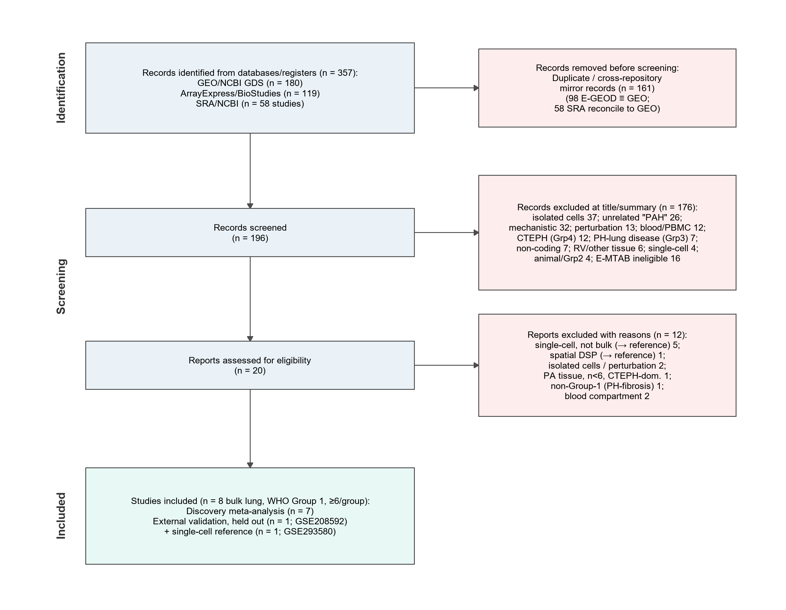

# PAH lung transcriptomic meta-analysis — pipeline scripts

Analysis code for a pre-registered, multi-cohort transcriptomic meta-analysis of pulmonary arterial hypertension (PAH, WHO Group 1) lung tissue. The pipeline combines seven independent public cohorts (five microarray, two RNA-seq) to define a reproducible differential-expression signature, localises it in a single-cell reference, and derives a compact diagnostic panel validated on an independent held-out cohort.

> Work in progress. Registered protocol: Zenodo [10.5281/zenodo.21399521](https://doi.org/10.5281/zenodo.21399521).

## Study selection (PRISMA 2020)

Systematic search of GEO, ArrayExpress/BioStudies, and SRA, screened to eight eligible bulk lung-tissue cohorts (seven discovery, one external validation) plus one single-cell reference.

<picture>
  <source media="(prefers-color-scheme: dark)" srcset="prisma_flow_dark.png">
  
</picture>

## Pipeline overview

Scripts run in numeric order; each is independent and reads/writes intermediate files. `00_config.R` holds shared paths, the seed (1234), and the colour palette.

**1 — Preprocessing** (`01a`–`01e`)
- `01a_build_phenotypes.py` — parse GEO series-matrix metadata into case/control labels (Group-1 PAH vs non-PH control), dropping non-eligible samples.
- `01b_preprocess_affymetrix.R` — RMA normalisation of Affymetrix Gene 1.0 ST arrays; probe → gene symbol (highest-mean collapse).
- `01c_preprocess_rnaseq.R` — RNA-seq counts (rounded; sequencing replicates summed per subject) and, for the FPKM-only cohort, log2-FPKM.
- `01d_preprocess_agilent_illumina.R` — Agilent one-colour (normexp + quantile) and processed-Illumina normalisation.
- `01e_qc_pca.R` — per-cohort PCA and outlier scan for quality control.

**2 — Per-study differential expression** (`02`)
- limma (microarray), DESeq2 (RNA-seq counts, with sex/batch covariates), and limma-trend (FPKM). Emits a standardised table per cohort: gene, log2 fold change, standard error, FDR.

**3 — Meta-analysis** (`03a`, `03b`)
- `03a_meta_analysis.R` — random-effects meta-analysis (metafor, REML) with per-gene I²/τ², plus rank aggregation (RobustRankAggreg). The consensus signature is FDR < 0.05, |pooled log2FC| ≥ 0.585, and directional concordance in ≥ 6 of 7 cohorts.
- `03b_sensitivity_analyses.R` — leave-one-out, cohort-collapse, and PVOD-exclusion robustness; identifies the genes that survive every scenario (the "robust core").

**4 — Downstream characterisation** (`04`–`06`)
- `04_functional_enrichment.R` — GO / KEGG / Reactome over-representation and gene-set enrichment (clusterProfiler, ReactomePA).
- `04b_enrichment_expanded.R` — expanded over-representation across GO biological process, cellular component, and molecular function and KEGG pathways, for the diagnostic panel, the consensus signature, and the meta-significant genes (pooled and split by direction); GO terms collapsed with `simplify()`. Writes `TableS3c`.
- `04c_enrichment_figures.R` — faceted GO/KEGG dot-plot figures from `04b` (Figure 5 consensus; Figures S2 panel and S3 up/down).
- `05_singlecell_localisation.R` — rebuild the single-cell lung reference (Seurat) and assign each signature gene a cell-of-origin.
- `06_deconvolution_ssgsea.R` — immune/stromal composition per cohort by ssGSEA (GSVA).

**5 — Diagnostic panel** (`07`)
- `07_classifier_validation.R` — per-cohort gene z-standardisation, LASSO logistic regression under nested cross-validation, and a single-shot evaluation on the held-out cohort (ROC/AUC, calibration).
- `07b_insilico_qpcr.R` — **post-hoc** in silico qPCR (not part of the registered plan): per-sample expression of the 13 panel genes relative to the geometric mean of two reference genes (TBP, SDHA), on one microarray (GSE117261) and one RNA-seq (GSE254617) cohort; GAPDH is avoided because it is differentially expressed between PAH and control here. Per-gene violin plots (Figure 9) and `TableS9`.

**6 — Figures** (`08b`–`08d`)
- Volcano, cross-cohort heatmap, forest plots, single-cell, deconvolution, and validation figures, including multi-panel composites. The enrichment figures (5, S2, S3) and the in-silico-qPCR figure (9) are produced by `04c` and `07b` above.

**7 — Reviewer-response analyses** (`09a`–`09c`)
- `09a_composition_adjusted.R` — composition-adjusted meta-analysis: adds cohort-level cell-type scores (ssGSEA) as covariates to separate per-cell regulation from cell-composition shifts, and reports which consensus genes survive.
- `09b_leave_one_cohort_out.R` — leave-one-cohort-out validation: trains on six discovery cohorts, tests on the seventh, giving generalisation estimates beyond the single external cohort.
- `09c_panel_diagnostics.R` — panel robustness: random-forest nested cross-validation, panel performance with KRT4/ITLN2 removed, single-cohort artefact check for the most significant genes, and the two-method (metafor ∩ RobustRankAggreg) intersection.

## Reproducing the environment

The exact package set (R 4.6.1, Bioconductor 3.22/3.23, 291 packages) is pinned in `renv.lock`.

```r
install.packages("renv")
renv::restore()            # restores the pinned library
```

Or build the container:

```bash
docker build -t pah-pipeline .
docker run -v /path/to/project:/data -w /data pah-pipeline Rscript submission/scripts/03a_meta_analysis.R
```

## Running

Paths are relative; run from the project root (or from this folder — `00_config.R` auto-detects). Example:

```bash
Rscript submission/scripts/02_differential_expression.R
```

## Data

All input datasets are public in the NCBI Gene Expression Omnibus (GEO). Discovery: GSE113439, GSE117261, GSE53408, GSE15197, GSE48149, GSE254617, GSE272776. External validation: GSE208592. Single-cell reference: GSE293580. No raw data is stored in this repository.
